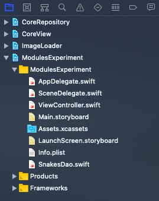

# iOS Modules Test
Testing out modules in an iOS app.

The basic idea is to split out bits of standalone functionality into seperate projects in the workspace, then include them in the main app as frameworks.

The benefit is that when you build the app, the swift files of the frameworks will not have to be compiled unless they are changed.

## Modules

### CoreRepository
Contains class for fetching data that the app uses.  In this app the data is just stored as json files in the app bundle.

------
### CoreView
View framework for the screens in the app.  Currently the only view besides the main screen is the detail page so the fact that it gets its own module seems kinda redundant but for the sake of the demo i'll keep it in.

------
### ImageLoader
Provides UIImageView extensions for asynchronously loading images.  Currently just wrapping Kingfisher api but if I wanted to swap out Kingfisher for something else in the future it would be really simple and require no changes to the main app.

&nbsp;

### Here's what it looks like in Xcode

